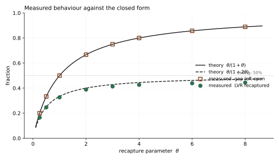

<h1 align="center">Kairos</h1>

<p align="center">
  <b>An AMM that prices the cost each trade imposes on its own liquidity providers.</b><br>
  <sub>καιρός — <i>the opportune moment</i>. Every mechanism here is about <b>when</b>.</sub>
</p>

<p align="center">
  
  
  
  
</p>

---

Liquidity providers in a constant-product pool pay about **σ²/8 per unit time** to arbitrageurs —
8% of pool value a year at 80% volatility — for the privilege of quoting a price that is always one
block stale. That is loss-versus-rebalancing, and a static fee cannot address it, because a static
fee cannot tell the arbitrageur apart from the person swapping $200.

Kairos charges for **price displacement** instead of for volume, estimates its own volatility from
its own price path, and pays fees in proportion to `liquidity × age` so that just-in-time liquidity
earns exactly nothing.

```
                       ┌─ ρ(d) = θ·|d| ────────── the impact premium
   fee = baseFee  +    │                          integral of a clamped marginal rate over
                       └─ clamped at 4σ√Δt        the price displacement the trade causes
```

Three mechanisms, one 700-line pool, no oracle, no admin, no upgrade path.

| | |
|---|---|
| **[Impact premium](src/libraries/ImpactFee.sol)** | A fee on how far a trade moves the price, not on how large it is. Derived to be exactly path-additive, so fragmenting a trade buys no discount. |
| **[Realised-volatility oracle](src/libraries/Volatility.sol)** | RiskMetrics EWMA over the pool's own price path. Bounds the premium, and is exposed publicly as an `IVolatilityFeed`. |
| **[Maturity calendar](src/libraries/MaturityCalendar.sol)** | O(1) time-weighted fee accounting. A JIT position minted and burnt in one block earns zero, and the forfeited share goes to whoever was already there. |

---

## The result

The design has one parameter, `θ`. Solving the arbitrageur's optimisation against the fee schedule
gives a closed form: **it closes only `1/(1+θ)` of each block's price gap**, and in equilibrium
liquidity providers retain

$$\text{recapture} = \frac{\theta}{1 + 2\theta}$$

of the loss-versus-rebalancing they would otherwise pay. [`sim/kairos_sim.py`](sim/kairos_sim.py)
tests this by letting a profit-maximising arbitrageur solve its own problem numerically against the
exact fee rule the Solidity implements — the closed form appears nowhere in the measurement path.

| θ | gap left open | theory `θ/(1+θ)` | LVR recaptured | theory `θ/(1+2θ)` |
|---:|---:|---:|---:|---:|
| 0.25 | 20.00% | 20.00% | 16.50% | 16.67% |
| 1 | 50.01% | 50.00% | 32.66% | 33.33% |
| 3 | 75.01% | 75.00% | 41.33% | 42.86% |
| 8 | 88.90% | 88.89% | 44.38% | 47.06% |



Note where recapture goes: **it saturates at 50%.** The naive reading of the per-block result —
`θ/(1+θ)`, approaching 100% — is wrong, and the simulation is what caught it. A pool that tracks the
market more slowly accumulates wider gaps, and wider gaps generate more LVR to begin with; past a
point the two effects cancel. **No fee schedule of this family recaptures more than half of LVR.**
The full derivation is in [the whitepaper](docs/WHITEPAPER.md#4-the-result-that-is-easy-to-get-wrong).

### Does it beat just raising the fee?

At a volatility that never changes: **no, not clearly.** A static fee tuned to a known σ is genuinely
competitive, and [RESULTS.md](docs/RESULTS.md) says so rather than burying it.

The case for a fee that is not a constant is that σ does not hold still. Across alternating
30%/200% volatility regimes, with fee-elastic flow that can go trade somewhere cheaper:

| configuration | LP return over an unfeed pool | LVR recaptured | retail pays | flow won |
|---|---:|---:|---:|---:|
| static 5 bps | +20.87% | 44.2% | 5.0 bps | 60.6% |
| static 10 bps | +27.22% | 61.5% | 10.0 bps | 36.7% |
| static 30 bps | +27.03% | 82.5% | 30.0 bps | 5.0% |
| **Kairos θ=6** | **+27.89%** | **65.5%** | **9.6 bps** | **46.5%** |

A static fee has to be wrong somewhere: priced for the calm regime it is picked off in the storm,
priced for the storm it drives away flow in the calm. Kairos gets there charging uninformed flow a
third of what the 30 bps pool does, and wins nine times as much of it.

**The model's limitations are real and are listed in full** — most importantly, its uninformed flow
is uninformed by construction, so it never picks off a stale pool, which structurally flatters high
static fees. Read [RESULTS.md](docs/RESULTS.md) before believing any of this.

---

## Quick start

```bash
git clone https://github.com/<you>/kairos && cd kairos
forge install
make test          # 98 tests across 9 suites
make sim           # regenerate docs/RESULTS.md and the charts
make gas           # gas benchmark
```

Requires [Foundry](https://getfoundry.sh) and, for the simulation, Python with `numpy` + `matplotlib`.

### Using a pool

```solidity
// Swap: fee = baseFee + θ·(displacement this trade causes), capped by realised volatility.
uint256 out = router.exactInputSingle(
    KairosRouter.ExactInputSingleParams({
        pool: pool, zeroForOne: true, amountIn: 1_000e18,
        amountOutMinimum: minOut, recipient: msg.sender, deadline: block.timestamp + 60
    })
);

// Provide liquidity. Fees accrue on a ramp: zero at mint, full weight at `maturityPeriod`.
router.addLiquidity(KairosRouter.AddLiquidityParams({
    pool: pool, salt: "my-position", liquidity: 100_000e18,
    amount0Max: a0, amount1Max: a1, owner: msg.sender, deadline: block.timestamp + 60
}));

// Read the pool's realised volatility — no off-chain publisher involved.
uint256 sigma = IVolatilityFeed(pool).annualizedVolatility();
```

---

## How it works

### The impact premium

Let `d = ln(P / P_ref)` be the pool's log displacement from a reference price. Kairos defines a
**marginal** rate `ρ(d) = θ·|d|` and charges a swap the *average of ρ over the interval it traverses*.

For a trade starting from a clean reference this is `θ·|m|/2` — exactly `θ` times the fee that would
make the arbitrageur's LVR extraction break even. And because the charge is the integral of a
marginal rate, it is **path-additive**: splitting a swap into any number of pieces costs the same.

The clamp is the subtle part, and it is the reason this design exists in the shape it does. Clamping
the *charge* silently breaks additivity — a late fragment's marginal rate exceeds the whole trade's
average rate, so a trader can split, stay under the clamp on every piece, and pay less. That was not
a hypothesis: a split-proofness test caught it, and the leak matched the arithmetic exactly
(`27.5/32 = 85.9%` with eight fragments). Kairos clamps the **marginal rate** and integrates that,
which is bounded *and* exactly additive.

### Time-weighted liquidity, in O(1)

Fees are split by `liquidity × min(1, age/maturity)`. The engineering problem is that every position's
weight changes every second, so the denominator is a moving target. While a position ramps, its
contribution is linear in time, which collapses the whole cohort into two running sums — and the one
event that will not fold into a sum, a position *reaching* maturity, is handled the way Uniswap V3
handles price ticks, but on the time axis: maturities snap onto a grid of buckets, a bitmap marks
which hold liquidity, and buckets are crossed lazily.

Snapping onto the grid does double duty. It bounds the crossing loop to 33 iterations no matter how
long the pool sat idle, and it makes settlement **exact** — fee growth only moves when the pool syncs,
and a bucket boundary always falls strictly after the previous sync.

### Fees on the output

Kairos takes its fee from the output token and holds it outside the reserves, which makes `x·y`
*exactly* invariant under a swap. Price and displacement are then determined by the gross input
alone: no fixed point to solve, one logarithm per swap, and donations that cannot move the price.

---

## Gas

| Operation | Gas |
|---|---|
| `swap` — first of a block, active pool | **34,208** |
| `swap` — same block, warm | **29,092** |
| `swap` — cold pool, first trade after a long idle | 204,063 |
| `mint` / `burn` / `collect` | 250,136 / 47,894 / 11,184 |

A steady-state swap is cheaper than Uniswap V2's, despite computing a logarithm, because the
invariant is preserved exactly and the whole hot path fits in three storage slots.

---

## Testing

98 tests across 9 suites, plus a deep profile at 20,000 fuzz runs and 512 invariant runs of depth 256.

- **Differential** — `lnWad` and `sqrtWad` against 60-significant-digit references generated by
  Python's `decimal` ([`gen_math_fixtures.py`](sim/gen_math_fixtures.py)), plus the functional
  identities `ln(ab) = ln a + ln b` and `sqrt(x)² ≤ x < (sqrt(x)+1)²`.
- **Property** — path-additivity of the fee schedule, the clamp bound, and the O(1) maturity
  accumulators fuzzed against a brute-force evaluation of the weight definition.
- **Invariant** — solvency, entitlements never exceeding the fee pot, weighted liquidity never
  exceeding supply, reserves staying positive, the cached log price never drifting from reserves.

Two real defects surfaced this way and were fixed: the clamp placement described above, and a pair
of public views that read the maturity calendar before advancing it — one over-reporting eligible
liquidity, the other reverting outright.

---

## Repository

```
src/
  KairosPool.sol            the protocol — no owner, no upgrade path, no pause
  KairosFactory.sol         CREATE2 deployment against an allow-list of configurations
  libraries/                ImpactFee · Volatility · MaturityCalendar · MathLib · FullMath · Lock
  periphery/                KairosRouter (deadlines, slippage, multi-hop) · KairosLens
test/                       unit · invariant · gas · 60-digit math fixtures
sim/                        the research simulation and the fixture generator
docs/                       WHITEPAPER · ARCHITECTURE · SECURITY · RESULTS
```

| Document | |
|---|---|
| [WHITEPAPER.md](docs/WHITEPAPER.md) | The derivations, including the recapture result and where the naive version goes wrong. |
| [RESULTS.md](docs/RESULTS.md) | Three simulation experiments, with limitations stated in full. |
| [ARCHITECTURE.md](docs/ARCHITECTURE.md) | Contracts, storage layout, the ordering constraints inside a swap. |
| [SECURITY.md](docs/SECURITY.md) | Trust model, manipulation analysis, known limitations. |

---

## Status

**Unaudited research software.** It has never held real value and is not deployed anywhere. The
mechanism design is the point; treat the code as a careful reference implementation of it, not as
something to put money in.

If you find a hole in the mechanism or the mathematics, open an issue — that is the interesting kind
of bug here.

## License

[BUSL-1.1](LICENSE), converting to GPL-2.0-or-later on 2030-01-01.
