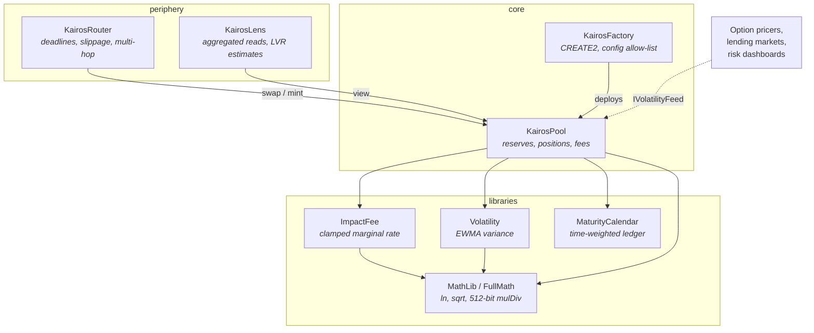

# Architecture



## Contracts

| Contract | Responsibility |
|---|---|
| [`KairosPool`](../src/KairosPool.sol) | The whole protocol. Reserves, swaps, positions, fee accounting, the price epoch and the volatility estimator. No owner, no upgrade path, no pause. |
| [`KairosFactory`](../src/KairosFactory.sol) | Deterministic `CREATE2` deployment against an allow-list of `(baseFee, theta, maturityPeriod)` configurations. Its owner can add configurations and nothing else. |
| [`KairosRouter`](../src/periphery/KairosRouter.sol) | Deadlines, slippage bounds, multi-hop routing. Holds no balance between transactions. |
| [`KairosLens`](../src/periphery/KairosLens.sol) | Read-only aggregation for front ends and risk dashboards. |

## Libraries

| Library | Responsibility |
|---|---|
| [`ImpactFee`](../src/libraries/ImpactFee.sol) | The clamped marginal rate `ρ(d) = θ·min(\|d\|, d_max)` and its integral. The clamp is on the rate, not the charge — that is what keeps it split-proof. |
| [`Volatility`](../src/libraries/Volatility.sol) | RiskMetrics EWMA on the *variance rate*, so irregular block sampling does not bias it. |
| [`MaturityCalendar`](../src/libraries/MaturityCalendar.sol) | O(1) maturity-weighted liquidity, with a lazily-crossed bucket calendar on the time axis. |
| [`MathLib`](../src/libraries/MathLib.sol) | `ln`, `log2`, `sqrt` in WAD fixed point, accurate to ~1e-17 and differentially tested against a 60-digit reference. |
| [`FullMath`](../src/libraries/FullMath.sol) | 512-bit `mulDiv`. |
| [`Lock`](../src/libraries/Lock.sol) | EIP-1153 transient reentrancy guard. |
| [`SafeTransferLib`](../src/libraries/SafeTransferLib.sol) | ERC-20 helpers tolerating non-standard return data. |

## Storage layout

The hot path touches three slots. Everything a swap needs is packed into them.

```
slot 0  reserves       uint128 reserve0 | uint128 reserve1
slot 1  _clock         uint128 totalLiquidity | uint32 lastSyncTime | uint32 epochTime
                       | uint32 prevEpochTime | uint32 lastBlockNumber
slot 2  _oracle        int72 blockStartLogPrice | int72 lastLogPrice | uint80 varianceRateWad
```

`int72` covers log prices for any reserve ratio expressible in `uint128` (`|ln| ≤ 88.7`), and
`uint80` covers any variance rate the clamped estimator can produce.

## The lifecycle of a swap

```mermaid
sequenceDiagram
    participant T as Trader
    participant P as KairosPool
    participant C as MaturityCalendar

    T->>P: swap(zeroForOne, amountIn, minOut, to, data)
    P->>P: Lock.acquire()
    P->>C: sync(now) — cross matured buckets, snapshot fee growth
    P->>P: rollEpoch() — fold last block's move into the EWMA,<br/>reset the block-open price
    P->>P: constant product → gross output (k exactly preserved)
    P->>P: one lnRatio → new log price → displacement d0 → d1
    P->>P: fee = base + ImpactFee.premium(d0, d1, θ, cap)
    P->>P: write reserves, cached log price, fee growth ÷ effective liquidity
    P->>T: transfer output
    P->>T: kairosSwapCallback (flash-swap window)
    P->>P: verify payment; any surplus credited to LPs, not to reserves
    P->>P: Lock.release()
```

Ordering matters and is not incidental:

1. **Sync before fees.** A bucket crossing records the fee growth that held at its boundary. Because
   fee growth only moves when the pool syncs, and a boundary always falls strictly after the previous
   sync, the recorded value is exact rather than approximate.
2. **Roll the epoch before quoting.** The premium is measured against the price this block opened at,
   so the epoch has to be current before the fee is computed.
3. **Effects before interactions.** The callback runs against fully written state, and the balance
   check that follows is what makes the optimistic transfer safe.

## Gas

Measured by [`test/Gas.t.sol`](../test/Gas.t.sol), which calls the pool directly and asserts ceilings
so a regression fails CI rather than shipping.

| Operation | Gas |
|---|---|
| `swap` — first of a block, active pool | **34,208** |
| `swap` — same block, everything warm | **29,092** |
| `swap` — cold pool, first trade after a long idle | 204,063 |
| `mint` | 250,136 |
| `burn` | 47,894 |
| `collect` | 11,184 |

The steady-state swap is cheaper than a Uniswap V2 swap, despite computing a logarithm, because
`x·y = k` is preserved exactly and every slot on the path is already warm. The cold-pool figure is
the honest worst case: every storage slot is cold, the epoch rolls, the oracle folds in an
observation, and the maturity calendar crosses the buckets that matured while nobody was looking. The
first caller after a long silence pays for all of it; `poke()` exists so that caller does not have to
be a trader.

`lnRatio` — a 59-iteration squaring loop for full WAD precision — costs a few thousand gas and runs
once per swap. A cheaper series over the near-unity range that real swaps occupy would trim it, at
the cost of a second code path to reason about. It has been left as one exact implementation.
