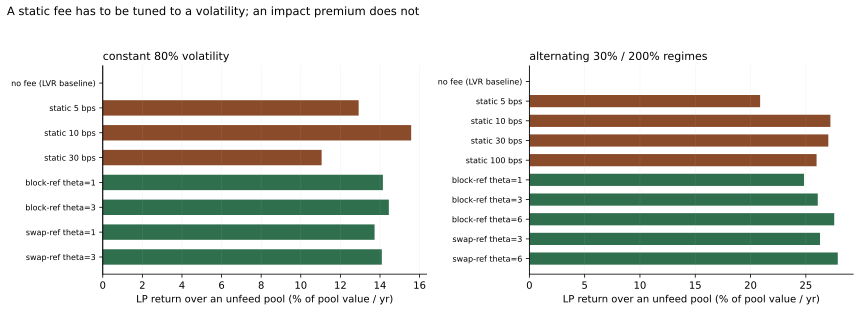

# Simulation results

> Generated by [`sim/kairos_sim.py`](../sim/kairos_sim.py). Every number here is measured,
> not derived: the arbitrageur solves its own profit maximisation numerically against the
> exact fee rule in [`src/libraries/ImpactFee.sol`](../src/libraries/ImpactFee.sol). The
> closed form appears only in the `theory` columns, for comparison.

## Setup

- 60,000 blocks of 12s (~8.3 days) per configuration
- External price: geometric Brownian motion, seed `7`
- Pool seeded at 1,000,000 / 1,000,000; fees taken from the output, held outside reserves
- Uninformed flow: 4 trades per block, mean 0.5 bps of the pool each, filling with probability `exp(-fee / 10bps)`

The elasticity matters. Without it, any pool can buy unlimited LVR protection for free by
raising its fee, and every comparison against a static-fee pool is meaningless.

## Experiment 1 — does the closed form hold?

Arbitrage only, no base fee, no clamp, so the impact premium is the only force acting on
the arbitrageur. Two independent quantities are measured, and the theory predicts different
values for each:

- the fraction of each block's gap the arbitrageur declines to close — predicted `θ/(1+θ)`;
- the fraction of loss-versus-rebalancing that never reaches it — predicted `θ/(1+2θ)`,
  which is *smaller*, because a pool that tracks more slowly accumulates wider gaps and
  gives part of the saving back.

A check on the simulator first: with no fee at all it reproduces the analytic LVR rate
`σ²/8` — measured **-7.58%/yr** against **8.00%/yr**.

| θ | gap left open | theory `θ/(1+θ)` | LVR recaptured | theory `θ/(1+2θ)` |
|---:|---:|---:|---:|---:|
| 0.25 | 20.00% | 20.00% | 16.50% | 16.67% |
| 0.5 | 33.34% | 33.33% | 24.65% | 25.00% |
| 1 | 50.01% | 50.00% | 32.66% | 33.33% |
| 2 | 66.67% | 66.67% | 38.83% | 40.00% |
| 3 | 75.01% | 75.00% | 41.33% | 42.86% |
| 4 | 80.01% | 80.00% | 42.62% | 44.44% |
| 6 | 85.72% | 85.71% | 43.85% | 46.15% |
| 8 | 88.90% | 88.89% | 44.38% | 47.06% |

The tracking prediction is exact to two decimal places across the whole sweep. The recapture
prediction is exact for small `θ` and drifts by ~3 points by `θ = 8`, where gaps grow large
enough that the second-order expansion behind the closed form starts to bind.

**The ceiling is the interesting part.** `θ/(1+2θ)` saturates at 50%: no amount of
impact premium recaptures more than half of LVR, because slowing the pool's price tracking
widens the gaps that generate LVR in the first place. Anyone claiming a fee schedule alone
eliminates LVR is not accounting for that feedback.

## Experiment 2 — LP economics at a constant 80% volatility

| configuration | LVR / yr | fees / yr | net vs HODL / yr | vs no-fee pool | LVR recaptured | retail cost | flow won |
|---|---:|---:|---:|---:|---:|---:|---:|
| no fee (LVR baseline) | -10.02% | 0.00% | -10.09% | +0.00% | — | 0.0 bps | 100.0% |
| static 5 bps | -3.54% | 12.92% | 2.83% | +12.92% | 64.7% | 5.0 bps | 60.6% |
| static 10 bps | -2.07% | 15.58% | 5.48% | +15.58% | 79.3% | 10.0 bps | 36.7% |
| static 30 bps | -0.72% | 11.05% | 0.96% | +11.05% | 92.8% | 30.0 bps | 5.0% |
| block-ref theta=1 | -3.31% | 14.15% | 4.05% | +14.15% | 67.0% | 6.9 bps | 50.7% |
| block-ref theta=3 | -3.54% | 14.45% | 4.35% | +14.45% | 64.6% | 9.1 bps | 40.6% |
| swap-ref theta=1 | -3.24% | 13.73% | 3.63% | +13.73% | 67.7% | 5.9 bps | 57.7% |
| swap-ref theta=3 | -3.23% | 14.09% | 4.00% | +14.09% | 67.7% | 7.6 bps | 52.6% |

At a volatility that never changes, the best configuration here is **static 10 bps**
at 5.48%/yr. A static fee tuned to a known σ is genuinely
competitive, and this table says so. The impact premium's advantage at fixed σ is that it
reaches a similar outcome while charging uninformed flow less — it wins more of the flow at
a lower average price — but it is not a free lunch.

## Experiment 3 — regimes alternating between 30% and 200%

This is the case a static fee cannot answer. The pool is deployed once and must live through
both regimes with the parameters it was given.

| configuration | LVR / yr | fees / yr | net vs HODL / yr | vs no-fee pool | LVR recaptured | retail cost | flow won |
|---|---:|---:|---:|---:|---:|---:|---:|
| no fee (LVR baseline) | -29.29% | 0.00% | -11.80% | +0.00% | — | 0.0 bps | 100.0% |
| static 5 bps | -16.33% | 20.87% | 9.07% | +20.87% | 44.2% | 5.0 bps | 60.6% |
| static 10 bps | -11.27% | 27.22% | 15.42% | +27.22% | 61.5% | 10.0 bps | 36.7% |
| static 30 bps | -5.13% | 27.03% | 15.23% | +27.03% | 82.5% | 30.0 bps | 5.0% |
| static 100 bps | -1.73% | 25.96% | 14.17% | +25.97% | 94.1% | 100.0 bps | 0.0% |
| block-ref theta=1 | -13.44% | 24.84% | 13.04% | +24.84% | 54.1% | 7.2 bps | 47.6% |
| block-ref theta=3 | -12.34% | 26.08% | 14.28% | +26.08% | 57.9% | 9.4 bps | 37.7% |
| block-ref theta=6 | -10.52% | 27.57% | 15.77% | +27.57% | 64.1% | 11.4 bps | 30.8% |
| swap-ref theta=3 | -12.04% | 26.28% | 14.48% | +26.28% | 58.9% | 7.6 bps | 52.6% |
| swap-ref theta=6 | -10.09% | 27.89% | 16.09% | +27.89% | 65.5% | 9.6 bps | 46.5% |

Best here: **swap-ref theta=6** at 16.09%/yr.

A static fee has to be wrong somewhere. Priced for the calm regime it is picked off in the
stressed one; priced for the stressed regime it drives away flow in the calm one. The impact
premium is a function of realised displacement, so it charges more exactly when the market
is moving and relaxes back toward the base fee when it is not — without an oracle, a
governance vote, or a keeper.

## On the choice of reference price

`block-ref` measures displacement from the price the block opened at; `swap-ref` measures
each swap's own price impact. Both charge the top-of-block arbitrageur identically — it
trades first, so the two references coincide — and they differ only for flow that follows it
inside the same block. Experiment 2 shows them within about a point of each other.

Kairos ships `block-ref`, on the argument that a pool sitting far from where its block opened
is more likely to be stale, and that trading against a stale pool is exactly the flow that
should pay more. That argument is not something this model can test: its uninformed flow is
uninformed by construction, so it never exploits staleness. Treat the choice as open.

## Limitations

- One arbitrageur, perfectly informed, no gas cost, monopolist at the top of every block.
- Uninformed flow is uninformed by construction: it never picks off a stale pool, which
  understates the cost of the slower price tracking that larger `θ` produces.
- Single pool, single venue. No cross-venue routing, no CEX-DEX latency structure, no
  competing AMM absorbing the flow that this one turns away.
- Fee elasticity is a single exponential with one parameter; real flow is far messier.

